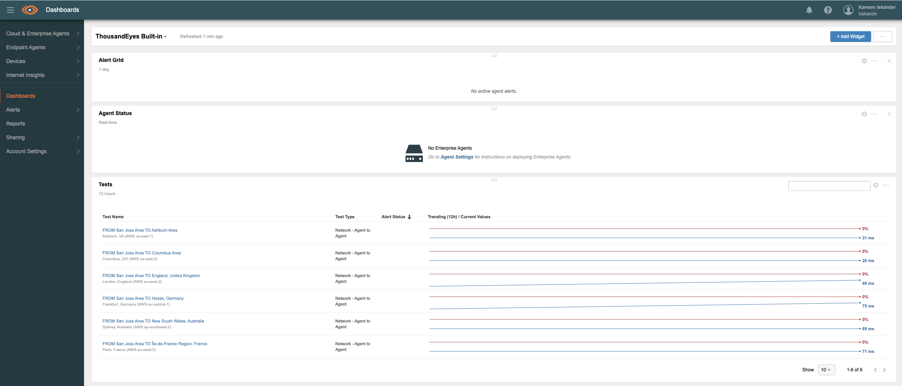
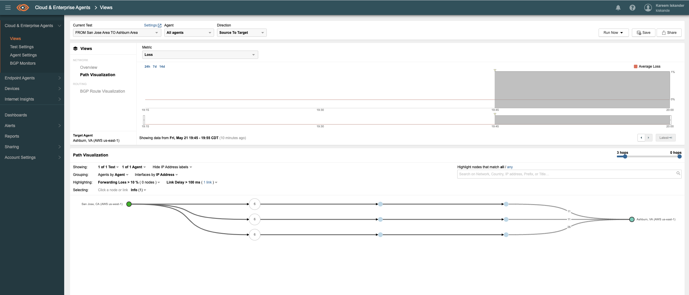

# Automating Test Creation with the ThousandEyes API

As adoption of ThousandEyes increases, customers are looking to monitor their applications and services hosted in IaaS providers such as AWS.
Leveraging TE's Cloud Agents hosted in multiple regions within a public cloud providers we are able to monitor inter-region performance, global connectivity and multi-cloud performance. 

**The problem** is manually creating multiple tests between cloud agent pairs over multiple regions can be taxing. 

**Solution** Leveraging [ThousandEyes APIs](https://developer.thousandeyes.com/) to automate the creation of our tests based on the target agents locations we are after.





## Requirements
1. Access to [ThousandEyes](https://www.thousandeyes.com/signup/) (15-Day Free Trial available)
2. [Python 3.7](https://www.python.org/) or above


## Getting Started
1. Clone Repo

`git clone https://github.com/CiscoDevNet/TE-Test-Automate.git` 

2. Install the required libraries

`pip install -r requirements.txt`


3. Update `Config.ini` with your Authorization Token.

>The ThousandEyes API accepts Basic HTTP or OAuth bearer token as authentication methods. This is specified using the HTTP request wrapper of your choice. Both the Basic Authentication Token and the OAuth Bearer Token referenced here and throughout the developer reference are available from your [Account Settings > Users](https://app.thousandeyes.com/account-settings/users-roles/?section=profile) and Roles page under the “Profile” tab, in the “User API Tokens” section.

 ```python
[TE]
token = Bearer <INSERT TOKEN HERE>
base_url = https://api.thousandeyes.com/v6
 ```

4. Define your Source & Target Cloud Agents in code. We need this to grab `agentId` to initiate a test

```Python
source_agent = "San Jose, CA (AWS us-west-1)"
target_agents = [
    'London, England (AWS eu-west-2)', 'Paris, France (AWS eu-west-3)', 'Columbus, OH (AWS us-east-2)',
    'Ashburn, VA (AWS us-east-1)', 'Sydney, Australia (AWS ap-southeast-2)', 'Frankfurt, Germany (AWS eu-central-1)'
                ]
```                
             
5. Run code

`python3 TE-Test.py`


## SUCCESS
You have successfully automated the creation of your Cloud to Cloud tests, to view created tests and results, head over to your dashboard.

  